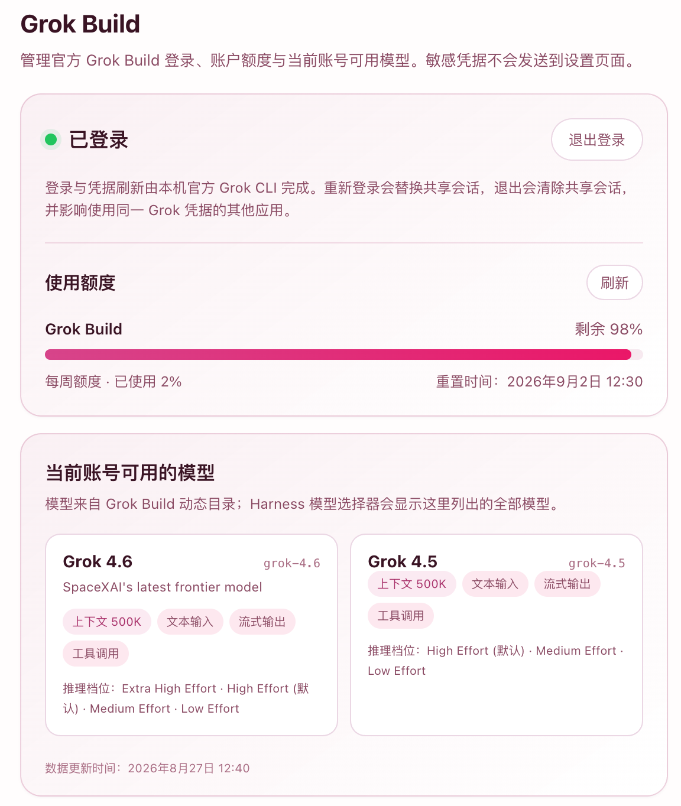
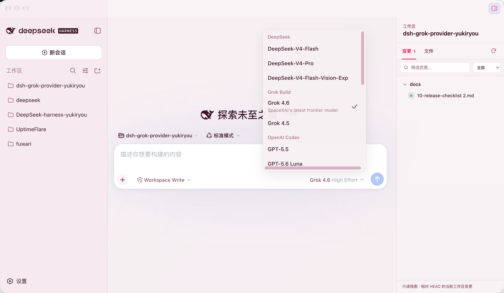
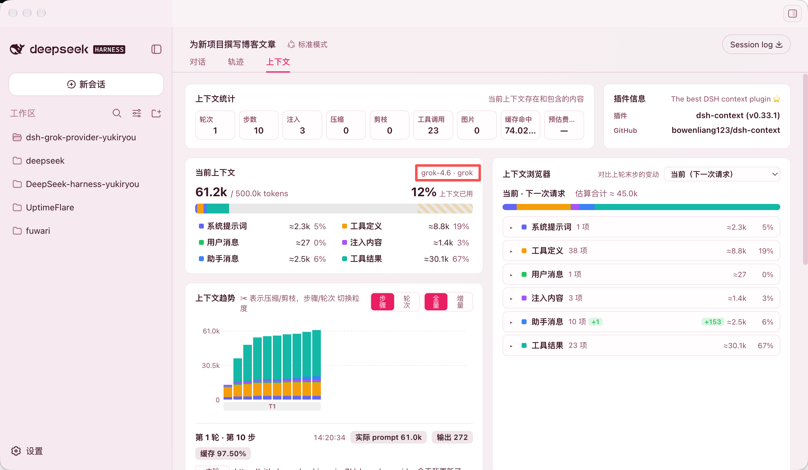

# dsh-grok-provider

[简体中文](README.md) | [English](README.en.md)

让 DeepSeek Harness 使用你已登录的官方 Grok Build 账号：动态模型发现、流式推理、工具调用，以及账号额度与模型能力面板。

> 非官方社区项目，与 xAI 或 DeepSeek Harness 官方无隶属关系。当前源码版本为 `0.1.4`；npm 已发布稳定版本以 Registry 的 `latest` 标签为准。项目不再发行预发行版；正式版缺陷通过新的递增稳定版本修复。

## 它解决什么问题

| 能力 | 当前实现 |
| --- | --- |
| 登录 | 调用官方 `grok login --oauth` 打开浏览器；插件不实现 OAuth grant |
| 凭据 | 复用官方 CLI 的登录状态；插件不创建第二份 token 存储 |
| 模型 | 运行时读取账号可见的全部 Grok Build 模型，不维护静态模型白名单 |
| 对话 | Responses 流式文本、reasoning、加密 reasoning replay、usage 与 finish reason |
| 图片 | 仅精确 `grok-4.6` 接收 Harness attachment 中有界的 JPEG/PNG 图片；`grok-4.5` 与其他模型保持 text-only |
| 工具 | 将 function call 交回 Harness 权限层；Provider 本身不执行工具 |
| 账户面板 | 登录状态、每周/月额度、重置时间、动态模型能力与 reasoning 档位 |
| 界面 | Web 设置页中英文切换；TUI 提供闭合的 `/grok` 命令 |

## 快速开始

### 1. 准备环境

- DeepSeek Harness `0.1.1-rc.2`
- Node.js `24.19.0` 或更高版本
- macOS arm64 或 Windows x64
- 官方 Grok Build CLI（支持 `login --oauth`，并使用官方默认 Grok home）

请从 [Grok Build 官方文档](https://docs.x.ai/build/overview) 安装 CLI，并先确认：

```sh
grok --version
grok models
```

首次运行 Grok CLI 会打开浏览器登录。插件只支持官方默认的 `~/.grok`（Windows 为 `%USERPROFILE%\.grok`）目录。

### 2. 安装 Provider

`0.1.4` 发布后，从 npm 安装该精确版本：

```sh
dsh plugin --profile web add dsh-grok-provider@0.1.4
dsh web
```

### 3. 登录并选择模型

打开 **设置 → Grok Build**：

1. 点击“使用 Grok 登录”；
2. 在官方 Grok CLI 打开的浏览器页面完成授权；
3. 返回 Harness，刷新账户面板；
4. 在模型选择器中选择当前账号可见的 Grok 模型。

插件不会接管登录页面，也不会要求粘贴 access token 或 refresh token。

## 使用界面

Web 设置页展示：

- 当前登录状态及登录、取消、退出操作；
- 已使用/剩余额度和真实周期重置时间；
- 当前账号可见模型、上下文窗口、reasoning 档位、streaming 与 tool capability。

当 protobuf-backed billing 返回完整的 weekly/monthly 周期但省略零值百分比时，页面会恢复为“已使用 0% / 剩余 100%”；其他不完整响应保持未知，不伪造额度。

## 插件预览

### 账户额度与模型能力



### Harness 模型选择器



### Grok 对话上下文



TUI 命令：

```text
/grok status
/grok login
/grok cancel
/grok logout
```

这些命令不会进入模型上下文。退出操作需要二次确认，因为它会调用官方 `grok logout`，并影响共享同一 Grok home 的其他客户端。

## 更新与卸载

更新已安装版本：

```sh
dsh plugin --profile web update dsh-grok-provider
dsh web
```

卸载：

```sh
dsh plugin --profile web remove dsh-grok-provider
dsh web
```

卸载插件不会删除官方 Grok CLI，也不会直接修改或删除 `auth.json`。

## 项目来源与发现

- npm `0.1.4` 页面（发布后可用）：[dsh-grok-provider@0.1.4](https://www.npmjs.com/package/dsh-grok-provider/v/0.1.4)
- GitHub `0.1.4` 发行版与校验值（发布后可用）：[v0.1.4](https://github.com/yoshino-xiao7/dsh-grok-provider/releases/tag/v0.1.4)
- GitHub 社区发现：仓库已添加 DeepSeek Harness 官方推荐的 `dsh-plugin` 与 `dsh` Topics
- YukiRyou 受管来源：[deepseek-yukiryou-plugin-catalog](https://github.com/yoshino-xiao7/deepseek-yukiryou-plugin-catalog)，当前仍锁定已完成真机验收的 `dsh-grok-provider@0.1.0`，且只标记 `darwin-arm64`

出现在目录中不代表 xAI 或 DeepSeek Harness 官方背书。项目已通过[收录 PR #3415](https://github.com/awesome-dsh-plugin/awesome-dsh-plugin/pull/3415) 进入公共 `awesome-dsh-plugin` 的 `model` 分类；该目录是仓库级发现入口，不承载精确 npm 版本或平台验收声明。

## 兼容性与范围

| 项目 | `0.1.4` 状态 |
| --- | --- |
| DeepSeek Harness | 精确支持 `0.1.1-rc.2` |
| Node.js | `>=24.19.0` |
| macOS arm64 | 已完成真实网络与隔离 Harness 验收 |
| Windows x64 | 代码与 Windows CI 支持；本次正式发布未完成独立真机验收 |
| macOS x64 / Linux | 不支持 |
| Grok CLI | 不锁完整版本；严格校验官方路径、`login --oauth` 能力与生产 OIDC 凭据契约 |
| 模型 | 当前账号目录中 backend 已被严格 codec 支持的全部模型 |

`0.1.4` 只为精确的 `grok-4.6` 开启图片输入；`grok-4.5` 与其他动态发现的模型继续按 text-only 处理。图片只能来自 Harness attachment service 的已验证 JPEG/PNG 投影，支持普通用户内容和一层工具结果中的图片，并按 xAI 官方 Responses 图片示例固定使用 `detail:"high"`；不接受 URL、文件路径、file ID 或调用方预制的 data URL。

每张投影图片最多 4 MiB、16,777,216 像素且任一边不超过 8192px；每次请求最多保留 8 张、投影字节合计最多 8 MiB。超限时按全局最旧优先移除图片并保留 Harness 的文本占位，最终 JSON 仍受 16 MiB 上限约束。Web/X Search、图片生成、任意文件下载、API Key 模式、多账号、企业 OIDC、ACP 与 Headless agent 封装仍不在本版本范围内；后续切片见[能力路线图](docs/11-capability-roadmap.md)。

## 工作原理

```text
Harness UI / TUI
       │ 仅发送闭合操作与脱敏 DTO
       ▼
dsh-grok-provider Host
       ├── 官方 Grok CLI：login / models / logout
       ├── 固定 Models/Billing endpoint：目录与额度
       └── 固定 Responses endpoint：流式推理
                    │
                    ▼
              xAI Grok Build
```

模型 ID 来自运行时目录，不是硬编码列表；图片 modality 则只对有独立协议与真机证据的精确模型 ID 开启。如果账号出现当前版本无法安全映射的新 backend，发现过程会失败关闭，而不是隐藏模型后宣称“全部支持”。

## 安全与隐私

- 模型、目录和计费请求只允许编译时固定的 HTTPS origin/path，并拒绝重定向。
- Renderer 和 RPC 不接收 token、`user_id`、凭据路径、任意 URL 或原始上游响应。
- Host 必须有界读取官方 `auth.json`，其原始文件可能包含 refresh token；解析器不使用、不缓存、不持久化 refresh token，只保留闭合校验所需元数据与短期 access-token lease。
- 插件不实现 refresh grant；凭据临近过期时，只能有界调用一次官方 `grok models`，再重新读取并验证官方文件。
- 登录子进程使用固定 argv、过滤后的环境、输出上限、deadline 与取消处理，不通过 shell 启动。
- 提示词、工具结果以及用户选择发送的图片投影会发往 xAI Grok Build 服务；插件本身不记录这些内容、原图或投影字节。

完整边界见[威胁模型](docs/03-security-threat-model.md)。发现安全问题时，请阅读[安全策略](SECURITY.md)，不要在公开 Issue 中提交 token、`auth.json`、个人信息或完整诊断日志。

## 常见问题

### 页面显示“找不到 Grok CLI”

确认官方 CLI 位于默认路径，并在终端执行 `grok --version`。插件不会从 PATH、工作区或 UI 指定的任意路径加载可执行文件。

### 页面要求重新登录

在设置页点击登录，或先在终端运行 `grok login --oauth`。插件不锁完整 CLI 版本，但路径、`--oauth` 能力或生产 OIDC 凭据契约不匹配时会失败关闭。

### 没有看到某个模型

先运行 `grok models`，确认该模型对同一账号可见。Provider 动态返回全部合法目录记录；未知 backend 会让发现失败，而不会被静默过滤。

### 为什么额度百分比显示未知

完整类型化周期下缺失的 protobuf 零值会恢复为 0%；其他情况下，上游没有提供足够信息，插件会保留未知。OAuth token 过期时间绝不会冒充额度刷新时间。

### 从其他模型切换到 Grok 后立即提示响应无效

`0.1.2` 及更早版本不能转换部分包含特殊字符的第三方工具调用历史，典型情况是 Ark 调用 ID 中的 `|`。请更新到 `0.1.3` 或更高版本；新版本会保持工具调用与结果的关联，并在发送给 Grok 前安全映射不兼容的历史 ID。

### Windows 能用吗

代码和 Windows CI 覆盖 Windows x64。普通后续稳定修复不重复要求真机验收；认证流程、Harness subprocess seam 或平台安全策略发生变化时仍会定向验证。

## 开发

```sh
npm ci --ignore-scripts
npm test
npm run pack:check
```

该包没有普通 runtime dependency；Harness services 使用精确 peer dependency。`npm run build` 生成可丢弃的 `dist/`，npm tarball 不包含 `src/`、测试、spike 或本机证据。

项目导航：

- [`docs/README.md`](docs/README.md)：设计文档索引与当前决策；
- [`docs/04-harness-contract.md`](docs/04-harness-contract.md)：Harness 集成契约；
- [`docs/05-test-plan.md`](docs/05-test-plan.md)：平台、安全与发行门禁；
- [`docs/09-implementation-status.md`](docs/09-implementation-status.md)：实现与验收状态；
- [`docs/11-capability-roadmap.md`](docs/11-capability-roadmap.md)：`0.1.4` 起的内容类型路线；
- [`CHANGELOG.md`](CHANGELOG.md)：版本变化。

提交 Issue 或 PR 前请阅读[贡献指南](CONTRIBUTING.md)。认证、传输、凭据格式或发布边界的变化必须先更新对应 ADR/威胁模型，再开发和测试。

## 路线图

- [x] 官方 CLI 浏览器登录、动态模型目录和 Responses 流
- [x] Web/TUI 账户控制、额度面板与模型能力展示
- [x] 发布 `0.1.0` 并完成 Registry/provenance 回读
- [x] 配置 npm Trusted Publisher、撤销首发 Token，并加入 `dsh-plugin` Topic 与 YukiRyou catalog
- [x] 发布 `0.1.1` 文档与发布流程修正版
- [x] 发布 `0.1.2` Windows CLI 兼容性修正版
- [x] 发布 `0.1.3` 跨 Provider 工具调用历史兼容性修正版
- [x] `0.1.4`：仅精确 `grok-4.6` 图片输入；user/tool-result 红蓝语义 Proxy 门禁与最终 Harness attachment 复验均已通过，`grok-4.5` 已按失败关闭保持 text-only
- [ ] 后续独立切片：默认关闭、用户分别开启的 Web Search / X Search
- [ ] 再后续独立切片：默认关闭的图片生成（只收内联结果，提交 Harness attachment）
- [ ] 完成 Windows x64 独立真机验收并按需发布后续稳定修复版

完整切片、门禁与永久非目标见[能力路线图](docs/11-capability-roadmap.md)。路线图不是兼容性承诺；新增能力必须通过独立 ADR 与安全门禁。`prompt_cache_key` 不与图片输入捆绑；不引入任意 URL 下载或 API Key 模式。

## 许可证

[MIT](LICENSE)
