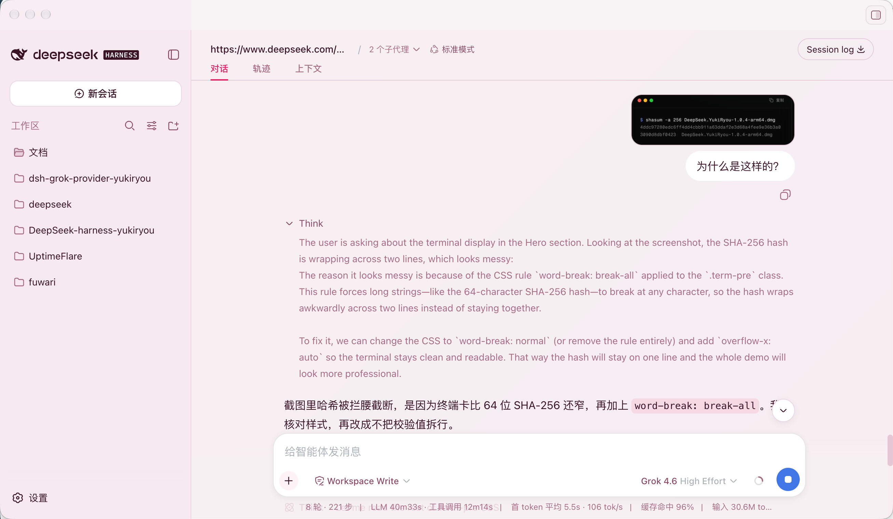

# dsh-grok-provider

[简体中文](README.md) | [English](README.en.md)

让 DeepSeek Harness 使用你已登录的官方 Grok Build 账号：动态模型发现、流式推理、图片输入、可选 Web/X Search、工具调用，以及账号额度与模型能力面板。

> 非官方社区项目，与 xAI 或 DeepSeek Harness 官方无隶属关系。本说明对应 `dsh-grok-provider@1.0.2` 制品；`0.1.8` 曾发布后撤回且版本号不可复用。

`1.0.2` 修复一个显示层问题：上游 Search 流可能产生完整闭合、但没有任何可见文本的 reasoning lifecycle。Provider 仍会严格验证这些 lifecycle，但不再把它们投影成空的 Harness `Think` 行；真正包含 summary/raw delta 的 reasoning 仍按独立块显示。

本 README 随 `1.0.2` 一起进入 npm tarball，下面的精确安装命令也固定为 `1.0.2`。发布状态、完整性摘要、签名、attestations 与 provenance 应以该版本的 npm Registry 和 GitHub Release 实际回读为准，不在制品冻结前预写。

## 它解决什么问题

| 能力 | 当前实现 |
| --- | --- |
| 登录 | 调用官方 `grok login --oauth`；登录 URL 生成与外部浏览器打开均由官方 CLI 负责，插件不实现 OAuth grant |
| 凭据 | 复用官方 CLI 的登录状态；插件不创建第二份 token 存储 |
| 模型 | 运行时读取账号可见的全部 Grok Build 模型，不维护静态模型白名单 |
| 对话 | Responses 流式文本、reasoning、加密 reasoning replay、usage 与 finish reason |
| 图片 | 仅精确 `grok-4.6` 接收 Harness attachment 中有界的 JPEG/PNG 图片；`grok-4.5` 与其他模型保持 text-only |
| 搜索 | 精确 `grok-4.6` 提供默认关闭的 Web/X Search；`1.0.1` 解决同名 function/server-tool 冲突，`1.0.2` 隐藏严格空 reasoning 的无内容 `Think` 投影 |
| 工具 | 将 function call 交回 Harness 权限层；Provider 本身不执行工具，关闭对应 Search 开关时保留本地 `web_search` / `x_search` |
| 账户面板 | 登录状态、每周/月额度、重置时间、动态模型能力与 reasoning 档位 |
| 界面 | Web 设置页中英文切换；TUI 提供闭合的 `/grok` 命令 |

## 快速开始

### 1. 准备环境

- DeepSeek Harness `0.1.1-rc.2`
- Node.js `24.19.0` 或更高版本
- macOS arm64 或 Windows x64
- 官方 Grok Build CLI（支持 `login --oauth`，并使用官方默认 Grok home）

请从 [Grok Build 官方文档](https://docs.x.ai/build/overview) 安装 CLI，并先确认：

```sh
grok --version
grok models
```

当网络可达且 OIDC discovery 成功时，首次运行 Grok CLI 会打开浏览器登录。插件只支持官方默认的 `~/.grok`（Windows 为 `%USERPROFILE%\.grok`）目录。

### 2. 安装 Provider

安装本说明对应的精确版本；执行前可在 npm Registry 核对该版本是否已可用：

```sh
dsh plugin --profile web add dsh-grok-provider@1.0.2
dsh web
```

### 3. 登录并选择模型

打开 **设置 → Grok Build**：

1. 点击“通过浏览器登录”；
2. 在官方 Grok CLI 打开的浏览器页面完成授权；
3. 返回 Harness，刷新账户面板；
4. 在模型选择器中选择当前账号可见的 Grok 模型。

插件不会接管登录页面，也不会要求粘贴 access token 或 refresh token。

## 使用界面

Web 设置页展示：

- 当前登录状态、Provider/Grok Build CLI 版本及登录、取消、退出操作；
- CLI 缺失或无效时的官方安装入口与“重新检测”操作；
- 已使用/剩余额度和真实周期重置时间；
- 当前账号可见模型、上下文窗口、reasoning 档位，以及图片输入、streaming 与 tool capability。
- 默认关闭且相互独立的 Web Search / X Search 开关，以及远端检索、额外用量、citation 和 prompt injection 风险提示。

当 protobuf-backed billing 返回完整的 weekly/monthly 周期但省略零值百分比时，页面会恢复为“已使用 0% / 剩余 100%”；其他不完整响应保持未知，不伪造额度。

当前 Harness `0.1.1-rc.2` 的 `settings.section` 没有插件图标字段。Provider 内嵌来自 `@deepseek-ai/dsh-client-ui-primitives@0.1.0-rc.7`、采用 MIT 许可的 `IconThinkOutline16` 路径几何；仅当设置对话框中的标签与 DOM 结构都精确且唯一匹配时，才用它显示 `Grok Build` 导航项，否则安全保留宿主齿轮。兼容层的观察器、标记和样式均随插件卸载清理。

## 插件预览

点击预览图可查看原图。

<table>
  <tr>
    <td colspan="3" width="50%" valign="top" align="center">
      <a href=".github/assets/plugin-preview/image-input.png"></a><br>
      <sub><strong>图片输入</strong> — Grok 4.6 直接分析 Harness 附件</sub>
    </td>
    <td colspan="3" width="50%" valign="top" align="center">
      <a href=".github/assets/plugin-preview/model-picker.png"></a><br>
      <sub><strong>模型选择</strong> — 按当前账户能力选择 Grok 4.6 或 Grok 4.5</sub>
    </td>
  </tr>
  <tr>
    <td colspan="4" width="66.67%" valign="top" align="center">
      <a href=".github/assets/plugin-preview/grok-context.png"></a><br>
      <sub><strong>对话上下文</strong> — 查看上下文统计与工具调用</sub>
    </td>
    <td colspan="2" width="33.33%" valign="top" align="center">
      <a href=".github/assets/plugin-preview/account-dashboard.png"></a><br>
      <sub><strong>账户面板</strong> — 额度、重置时间与动态模型能力</sub>
    </td>
  </tr>
</table>

TUI 命令：

```text
/grok status
/grok login
/grok cancel
/grok logout
```

这些命令不会进入模型上下文。退出操作需要二次确认，因为它会调用官方 `grok logout`，并影响共享同一 Grok home 的其他客户端。

## 更新与卸载

更新已安装版本：

```sh
dsh plugin --profile web update dsh-grok-provider
dsh web
```

卸载：

```sh
dsh plugin --profile web remove dsh-grok-provider
dsh web
```

卸载插件不会删除官方 Grok CLI，也不会直接修改或删除 `auth.json`。

## 项目来源与发现

- 本说明对应的 npm 精确版本：[dsh-grok-provider@1.0.2](https://www.npmjs.com/package/dsh-grok-provider/v/1.0.2)
- 上一版已完成回读的 GitHub Release：[v1.0.1](https://github.com/yoshino-xiao7/dsh-grok-provider/releases/tag/v1.0.1)
- 发布证据：release commit `3c25a53571531e35ac888df16df4fe6c01849e85`，annotated tag object `ab79b1bb1e408a0112166cadc26761a327819c3f` peel 至该提交，final CI run [`33312946205`](https://github.com/yoshino-xiao7/dsh-grok-provider/actions/runs/33312946205)，Trusted Publisher run [`33313699790` attempt 1](https://github.com/yoshino-xiao7/dsh-grok-provider/actions/runs/33313699790/attempts/1)。仓库所有者明确授权的唯一 tarball 含 73 个文件、240,904 bytes，unpacked size 748,888 bytes；SHA-1 为 `9e6449160947104e8dbb71b7201c53e81b073f83`，SHA-256 为 `e3e15646d38de23c32c71ed759f9c10be9b2d790d4b10b4b8dfe59a44fbfef9f`，SRI 为 `sha512-Bm1qjJQ9i7CWT0oWah7QKDVBP8dR2YQtvEEZGE/BOSwZCo8sZbrW2v2QSfUfLsOLHcQXFZZ0jlDCAztr1m/q+A==`。冻结候选、GitHub Release 与 npm Registry 制品逐字节一致；Node `24.19.0` / npm `11.5.1` 的 Registry 锁定隔离安装通过 Host `name`/`apply` 与 client `id`/factory smoke，生产依赖审计为 0 漏洞。`npm audit signatures` 确认安装图中 11 个包具有已验证 Registry 签名、2 个包具有已验证 attestations；本包公开 metadata 包含 1 个 Registry signature、2 个 attestations，SLSA provenance 精确绑定 `release.yml`、`refs/tags/v1.0.1`、release commit 与 publish run。
- npm 页面文档修正：`1.0.1` tarball 内曾保留旧安装示例；`1.0.2` 制品内的本 README 已改用精确 `@1.0.2` 命令。已发布的 `1.0.1` 字节不会被覆盖。
- GitHub 社区发现：仓库已添加 DeepSeek Harness 官方推荐的 `dsh-plugin` 与 `dsh` Topics
- YukiRyou 受管来源：[deepseek-yukiryou-plugin-catalog](https://github.com/yoshino-xiao7/deepseek-yukiryou-plugin-catalog)，当前仍锁定已完成真机验收的 `dsh-grok-provider@0.1.0`，且只标记 `darwin-arm64`

出现在目录中不代表 xAI 或 DeepSeek Harness 官方背书。项目已通过[收录 PR #3415](https://github.com/awesome-dsh-plugin/awesome-dsh-plugin/pull/3415) 进入公共 `awesome-dsh-plugin` 的 `model` 分类；该目录是仓库级发现入口，不承载精确 npm 版本或平台验收声明。

## 兼容性与范围

### `1.0.2` 修复边界

- 普通严格空 reasoning item 继续执行既有 ID/type、sequence、output index、状态、summary/content 空性、大小、可选 encrypted content 与闭合校验；Search-backed 同 ID 复用项继续额外执行精确 own-data 键集与 accessor 拒绝。本版没有扩大协议接受域。
- Provider 延迟创建 Harness reasoning block，只有收到首个非空 summary/raw delta 才发送 `block-start`，随后按原顺序发送 delta 和 `block-end`。完整生命周期最终为空时产生零个可见 reasoning chunk。
- 多个非空 reasoning item 继续按 output index 保持独立块；正文、工具调用、usage、finish reason、可见非空 reasoning replay、Search 后 replay 抑制和失败关闭行为不变。被隐藏的普通空 item 不占可见 block/replay 对齐槽，其有界 encrypted content 通过校验后不持久化。
- 修复只影响升级后的新回复；旧会话中已经持久化的空 `Think` 行不会被回写删除。
- 本版不改变 Search 开关、模型、认证、图片、固定 endpoint、citation/URL 或 Harness 工具权限边界，也不构成 Windows 真机浏览器登录验收。

### `1.0.1` 修复边界

- 根因不是模型、账号、Search 响应形状或 42 项工具总数，而是启用 server Search 时，同名 Harness function definition 与 `{ type: "web_search" }` / `{ type: "x_search" }` 共存；固定 Proxy 对该组合返回 HTTP 400。
- 编译器先完整验证 40 个源 functions，再仅过滤与已启用 server Search 同名的 wire definitions。关闭对应开关时，本地工具保持原样；已有会话中的历史 `function_call` / `function_call_output` 也不删除或改名。
- 最终 request receipt 拒绝 function/server-tool 名称交集；SSE parser 保留 source transport error，HTTP 400 因而映射到 `PROVIDER_ERROR`，真正的 SSE/协议错误仍为 `INVALID_RESPONSE`。
- 一次经明确授权的脱敏真实账号回放使用原失败 X 会话结构：8 条 messages、40 个 source functions、wire 38 functions + 2 server tools、保留 2 个历史 reserved-name calls；只执行 1 次 models GET 和 1 次 Responses POST，接收 314 events 并以 `response.completed` 闭合。未保存消息/回复正文、URL、身份或凭据。
- 精确 Node `24.19.0` 本地全量门禁为 253 tests、251 pass、0 fail、2 platform skips；生产依赖审计为 0 漏洞，隔离 cache 的 dry-run pack 列出 73 个文件，秘密模式扫描只命中显式 fixture canary 及其检查表记录。代码 PR #31、main CI run `33312621786`、最终 release commit、双平台 final CI、唯一授权制品、隔离安装、Registry、签名、attestations 与 provenance 回读均已完成；这些证据仍不代表 Windows 真机浏览器登录已经完成。详情见 [`docs/releases/v1.0.1.md`](docs/releases/v1.0.1.md)。

### `1.0.0` 修复边界

- 一个 reasoning ID 的原始生命周期必须先闭合，并且首次复用前必须已有一个完成的 Web/X server Search；之后只允许它以严格空占位再次出现。
- “严格空”是指可见 summary/content 为空，且没有 summary/raw lifecycle；允许有界、不透明的 `encrypted_content`，但不会把它当作可见 reasoning 或保存上游明文。
- 每次复用都必须收到独立的 `response.output_item.done`；若 `response.incomplete` 到来时仍有复用段未闭合，则返回通用非法响应错误，所有复用段已闭合后的 `max_output_tokens` 终态仍有效。非空 summary/raw、跨类型、未知 terminal 字段或 accessor 字段继续拒绝。
- 完成态 `open_page` 只接受精确 `type + url`，streamed/final action 的类型与 URL 必须一致；Provider 校验后丢弃 URL，不会访问、预览、下载或回放。
- 最终源码完成两层脱敏真实账号复验：原始 Web/X 协议探针各 1 次请求、各 64 events，分别观察到对应 Search 且终态 `completed`；生产 adapter 共完成 5 次 Responses，direct Web/X 均为 `stop`，Harness 形状的本地 `x_search` call/result 续跑三轮依次为 `tool-calls`、`tool-calls`、`stop`，前两轮各 1 次本地调用。该续跑没有在同一 wire request 中同时放入 Harness `x_search` function definition 与 xAI `{ type: "x_search" }` server descriptor；`1.0.1` 后续才隔离出这一 HTTP 400 冲突。未保存结果、URL、prompt、身份或凭据；这些不是发布、OAuth 或 Windows 真机证据。
- manifest/lock 已同步为 `1.0.0`；Node 24 全量测试为 245 项、243 pass、0 fail、2 项平台跳过，生产依赖审计为 0 漏洞，确定性 build/bundle、72 项 dry-run pack、秘密模式扫描与 diff 检查均通过。代码 PR #28、main CI run [`33308371009`](https://github.com/yoshino-xiao7/dsh-grok-provider/actions/runs/33308371009)、最终 release commit、双平台 final CI、唯一制品、精确授权及 Registry/signature/attestation/provenance 回读均已完成。

| 项目 | `1.0.2` 制品边界 |
| --- | --- |
| DeepSeek Harness | 精确支持 `0.1.1-rc.2` |
| Node.js | `>=24.19.0` |
| macOS arm64 | 图片发送已完成真实 Harness 验证；`1.0.2` 只调整严格空 reasoning 的可见投影 |
| Windows x64 | 代码路径与现有 slow-fake 保持不变；网络可达时由官方 CLI 生成 URL 并打开浏览器，该路径仍未完成 Windows 真机验收 |
| macOS x64 / Linux | 不支持 |
| Grok CLI | 不锁完整版本；严格校验官方路径、`login --oauth` 能力与生产 OIDC 凭据契约 |
| 模型 | 当前账号目录中 backend 已被严格 codec 支持的全部模型 |

`0.1.11` 沿用已发布版本的图片边界：只为精确的 `grok-4.6` 开启图片输入；`grok-4.5` 与其他动态发现的模型继续按 text-only 处理。图片发送已在真实 Harness 对话中确认可用。图片只能来自 Harness attachment service 的已验证 JPEG/PNG 投影，支持普通用户内容和一层工具结果中的图片，并固定使用 `detail:"high"`；不接受 URL、文件路径、file ID 或调用方预制的 data URL。普通 user/system 历史中的私有 reasoning 会被省略并保留相邻可见文本。

每张投影图片最多 4 MiB、16,777,216 像素且任一边不超过 8192px；每次请求最多保留 8 张、投影字节合计最多 8 MiB。超限时按全局最旧优先移除图片并保留 Harness 的文本占位，最终 JSON 仍受 16 MiB 上限约束。

已发布的 `0.1.10` 使用 Harness 官方 settings 模块注册并持久化两个 Search 设置；每个新调用在模型发现前读取一次最新值，已准备和在途调用保持原快照。真实使用随后发现精确 `grok-4.6` 在 High Effort + Web Search 续跑时，可能先关闭 reasoning 项，在一次 Search 完成后再把同一 ID 使用一次作为空占位，旧解码器会因此失败关闭。已发布的 `0.1.11` 仅在已完成 Search 位于两段 reasoning 之间时允许该 ID 以严格空项再出现一次，并增加官方 raw `reasoning_text` 生命周期；raw 与 summary 互斥，replay 元数据不保存 raw 明文，后续请求只发送 `encrypted_content` 与空 summary，当前流中的 raw delta 仍会作为 Harness 可见 reasoning 输出。脱敏真实探针观察到 34 个 summary delta、0 个 raw delta，因此只验证 summary/Search 路径，raw reasoning 仍只有 fixture 回归。Search 继续只对精确 `grok-4.6` 默认关闭地开放；远端活动不变成本地工具，citation URL 不会被打开或下载。搜索结果属于不可信远端数据，执行命令或修改文件前应核实来源。图片生成、任意文件下载、API Key 模式、多账号、企业 OIDC、ACP 与 Headless agent 封装仍不在本版本范围内；后续切片见[能力路线图](docs/11-capability-roadmap.md)。

## 工作原理

```text
Harness UI / TUI
       │ 仅发送闭合操作与脱敏 DTO
       ▼
dsh-grok-provider Host
       ├── 官方 Grok CLI：login / models / logout
       ├── 固定 Models/Billing endpoint：目录与额度
       └── 固定 Responses endpoint：流式推理
                    │
                    ▼
              xAI Grok Build
```

模型 ID 来自运行时目录，不是硬编码列表；图片 modality 则只对有独立协议与真机证据的精确模型 ID 开启。如果账号出现当前版本无法安全映射的新 backend，发现过程会失败关闭，而不是隐藏模型后宣称“全部支持”。

## 安全与隐私

- 模型、目录和计费请求只允许编译时固定的 HTTPS origin/path，并拒绝重定向。
- Renderer 和 RPC 不接收 token、`user_id`、凭据路径、任意 URL 或原始上游响应。
- Host 必须有界读取官方 `auth.json`，其原始文件可能包含 refresh token；解析器不使用、不缓存、不持久化 refresh token，只保留闭合校验所需元数据与短期 access-token lease。
- 插件不实现 refresh grant；凭据临近过期时，只能有界调用一次官方 `grok models`，再重新读取并验证官方文件。
- 登录子进程使用固定 argv、过滤后的环境、输出上限、deadline 与取消处理，不通过 shell 启动。
- 提示词、工具结果、用户选择发送的图片投影，以及启用 Search 后的检索词会发往 xAI Grok Build 服务；插件本身不记录这些内容、原图、投影字节或 citation URL。

完整边界见[威胁模型](docs/03-security-threat-model.md)。发现安全问题时，请阅读[安全策略](SECURITY.md)，不要在公开 Issue 中提交 token、`auth.json`、个人信息或完整诊断日志。

## 常见问题

### 页面显示“找不到 Grok CLI”

按页面中的官方安装入口安装 Grok Build CLI，再点击“重新检测”。确认 CLI 位于默认路径，并在终端执行 `grok --version`。插件不会自动安装 CLI，也不会从 PATH、工作区或 UI 指定的任意路径加载可执行文件。设置页会同时显示 Provider 与已验证 CLI 的版本。

### 页面要求重新登录

在设置页点击登录，或先在终端运行 `grok login --oauth`。插件不锁完整 CLI 版本，但路径、`--oauth` 能力或生产 OIDC 凭据契约不匹配时会失败关闭。

### Windows 点击登录后没有弹出浏览器

先直接运行官方 CLI：

```powershell
& "$env:USERPROFILE\.grok\bin\grok.exe" login --oauth
```

如果它在 `auth.x.ai/.well-known/openid-configuration` 超时，失败发生在生成登录链接之前，不是 Provider 的浏览器按钮失效。请检查 Windows 的 DNS、HTTPS 出站、防火墙、VPN 与代理；尤其是浏览器使用 PAC/系统代理、CLI 进程却没有 `HTTPS_PROXY` 的情况。不要关闭 TLS 校验，也不要把代理凭据、登录 URL、授权码或 token 提交到 Issue。

设置页会及时结算这个已知 discovery 超时并显示“浏览器登录尚未开始”；实际仍在运行的五分钟登录流程可以取消，未知 CLI 输出只显示脱敏的通用错误。这是对失败边界的准确诊断，不是插件自行打开浏览器，也不修复 Windows 的 DNS、代理、防火墙、VPN 或官方 CLI 行为。

### 没有看到某个模型

先运行 `grok models`，确认该模型对同一账号可见。Provider 动态返回全部合法目录记录；未知 backend 会让发现失败，而不会被静默过滤。

### 为什么额度百分比显示未知

完整类型化周期下缺失的 protobuf 零值会恢复为 0%；其他情况下，上游没有提供足够信息，插件会保留未知。OAuth token 过期时间绝不会冒充额度刷新时间。

### 从其他模型切换到 Grok 后立即提示响应无效

`0.1.2` 及更早版本不能转换部分包含特殊字符的第三方工具调用历史，典型情况是 Ark 调用 ID 中的 `|`。请更新到 `0.1.3` 或更高版本；新版本会保持工具调用与结果的关联，并在发送给 Grok 前安全映射不兼容的历史 ID。

### Windows 能用吗

代码、slow-fake 与 `0.1.9` Windows 2022 CI 已覆盖 Windows x64。官方 CLI 仍负责生成登录 URL 与打开外部浏览器；网络可达的 Windows 真机浏览器弹出尚未确认，因此不能表述为该问题已经修复或验证。

## 开发

```sh
npm ci --ignore-scripts
npm test
npm run pack:check
```

该包没有普通 runtime dependency；Harness services 使用精确 peer dependency。`npm run build` 生成可丢弃的 `dist/`，npm tarball 不包含 `src/`、测试、spike 或本机证据。

项目导航：

- [`docs/README.md`](docs/README.md)：设计文档索引与当前决策；
- [`docs/04-harness-contract.md`](docs/04-harness-contract.md)：Harness 集成契约；
- [`docs/05-test-plan.md`](docs/05-test-plan.md)：平台、安全与发行门禁；
- [`docs/09-implementation-status.md`](docs/09-implementation-status.md)：实现与验收状态；
- [`docs/11-capability-roadmap.md`](docs/11-capability-roadmap.md)：`0.1.4` 起的内容类型路线；
- [`CHANGELOG.md`](CHANGELOG.md)：版本变化。

提交 Issue 或 PR 前请阅读[贡献指南](CONTRIBUTING.md)。认证、传输、凭据格式或发布边界的变化必须先更新对应 ADR/威胁模型，再开发和测试。

## 路线图

- [x] 官方 CLI 浏览器登录、动态模型目录和 Responses 流
- [x] Web/TUI 账户控制、额度面板与模型能力展示
- [x] 发布 `0.1.0` 并完成 Registry/provenance 回读
- [x] 配置 npm Trusted Publisher、撤销首发 Token，并加入 `dsh-plugin` Topic 与 YukiRyou catalog
- [x] 发布 `0.1.1` 文档与发布流程修正版
- [x] 发布 `0.1.2` Windows CLI 兼容性修正版
- [x] 发布 `0.1.3` 跨 Provider 工具调用历史兼容性修正版
- [x] 发布 `0.1.4`：仅精确 `grok-4.6` 图片输入；user/tool-result 红蓝语义 Proxy 门禁与最终 Harness attachment 复验通过，`grok-4.5` 失败关闭为 text-only
- [x] 发布 `0.1.5`：发布链路、账户面板能力标签与 Provider Runtime 安装回滚维护版；唯一制品、双平台 CI、签名与 SLSA provenance 均已验证
- [x] 发布 `0.1.6`：图片历史 reasoning 兼容与 Windows 官方 CLI 分阶段 deadline 修复版；图片发送已完成真实 Harness 验证
- [x] 发布 `0.1.7`：Provider/CLI 双版本诊断、CLI 安装恢复、OIDC discovery 超时脱敏结算与 `IconThinkOutline16` 设置导航兼容层
- [x] 发布 `0.1.9`：加入 Web/X Search 协议与设置页，唯一制品、双平台 CI、签名与 SLSA provenance 均已验证；发布后确认 Host 设置 namespace 遗漏，开关不可用
- [x] 发布 `0.1.10`：`llm-grok` 注册、按调用读取设置、唯一制品、双平台 CI、签名与 provenance 已完成
- [x] 发布 `0.1.11`：修复 High Effort + Web Search reasoning 生命周期兼容；唯一制品、双平台 final CI、精确授权、Registry、签名、attestations 与 provenance 回读均已完成
- [x] 发布 `1.0.0`：修复多次严格空 reasoning ID 复用和完成态 Web Search `open_page` action；唯一制品、双平台 final CI、精确授权、Registry、签名、attestations 与 provenance 回读均已完成
- [x] 发布 `1.0.1`：修复 server Search 与 Harness 同名 function definition 的 HTTP 400 冲突，并保留真实 transport error 分类；唯一制品、双平台 final CI、精确授权、Registry、签名、attestations 与 provenance 回读均已完成
- [ ] 再后续独立切片：默认关闭的图片生成（只收内联结果，提交 Harness attachment）
- [ ] 完成 Windows x64 独立真机验收并按需发布后续稳定修复版

完整切片、门禁与永久非目标见[能力路线图](docs/11-capability-roadmap.md)。路线图不是兼容性承诺；新增能力必须通过独立 ADR 与安全门禁。`prompt_cache_key` 不与图片输入捆绑；不引入任意 URL 下载或 API Key 模式。

## 许可证

[MIT](LICENSE)。复用的 Harness 图标几何及其许可见 [`THIRD_PARTY_NOTICES.md`](THIRD_PARTY_NOTICES.md)。
